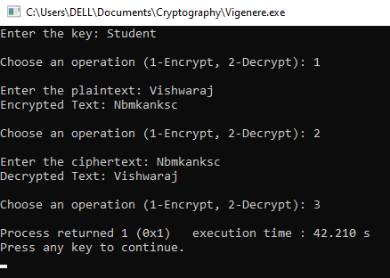

### Vishwaraj G.
### 212223220125
# Cryptography---19CS415-classical-techqniques
# Ex-1(d) Vigenere Cipher
Vigenere Cipher using with different key values

## AIM:

To develop a simple C program to implement Vigenere Cipher.

## DESIGN STEPS:

### Step 1:

* Design of Vigenere Cipher algorithnm 

### Step 2:

* Implementation using C or pyhton code

### Step 3:

* Testing algorithm with different key values. 
## ALGORITHM DESCRIPTION:
The Vigenere cipher is a method of encrypting alphabetic text by using a series of different Caesar ciphers based on the letters of a keyword. It is a simple form of polyalphabetic substitution.To encrypt, a table of alphabets can be used, termed a Vigenere square, or Vigenere table. It consists of the alphabet written out 26 times in different rows, each alphabet shifted cyclically to the left compared to the previous alphabet, corresponding to the 26 possible Caesar ciphers. At different points in the encryption process, the cipher uses a different alphabet from one of the rows used. The alphabet at each point depends on a repeating keyword.


## PROGRAM:
```
#include <stdio.h>
#include <string.h>
#include <ctype.h>

void vigenereCipherEncrypt(char* plaintext, char* key) {
    int textLen = strlen(plaintext);
    int keyLen = strlen(key);
    char encryptedText[textLen + 1];

    for (int i = 0, j = 0; i < textLen; i++) {
        char currentChar = plaintext[i];

        if (isalpha(currentChar)) {
            char base = isupper(currentChar) ? 'A' : 'a';
            encryptedText[i] = (currentChar - base + (tolower(key[j % keyLen]) - 'a')) % 26 + base;
            j++;
        } else {
            encryptedText[i] = currentChar;
        }
    }

    encryptedText[textLen] = '\0';
    printf("Encrypted Text: %s\n", encryptedText);
}

void vigenereCipherDecrypt(char* ciphertext, char* key) {
    int textLen = strlen(ciphertext);
    int keyLen = strlen(key);
    char decryptedText[textLen + 1];

    for (int i = 0, j = 0; i < textLen; i++) {
        char currentChar = ciphertext[i];

        if (isalpha(currentChar)) {
            char base = isupper(currentChar) ? 'A' : 'a';
            decryptedText[i] = (currentChar - base - (tolower(key[j % keyLen]) - 'a') + 26) % 26 + base;
            j++;
        } else {
            decryptedText[i] = currentChar;
        }
    }

    decryptedText[textLen] = '\0';
    printf("Decrypted Text: %s\n", decryptedText);
}

int main() {
    char text[100], key[100];
    int choice;

    printf("Enter the key: ");
    fgets(key, sizeof(key), stdin);
    key[strcspn(key, "\n")] = 0;

    while (1)
    {
        printf("\nChoose an operation (1-Encrypt, 2-Decrypt): ");
        scanf("%d", &choice);
        getchar();
        switch (choice) {
            case 1:
                printf("\nEnter the plaintext: ");
                fgets(text, sizeof(text), stdin);
                text[strcspn(text, "\n")] = 0;
                vigenereCipherEncrypt(text, key);
                break;

            case 2:
                printf("\nEnter the ciphertext: ");
                fgets(text, sizeof(text), stdin);
                text[strcspn(text, "\n")] = 0;
                vigenereCipherDecrypt(text, key);
                break;

            default:
                exit(1);
        }
    }

    return 0;
}
```
## OUTPUT:

## RESULT:
The program is executed successfully